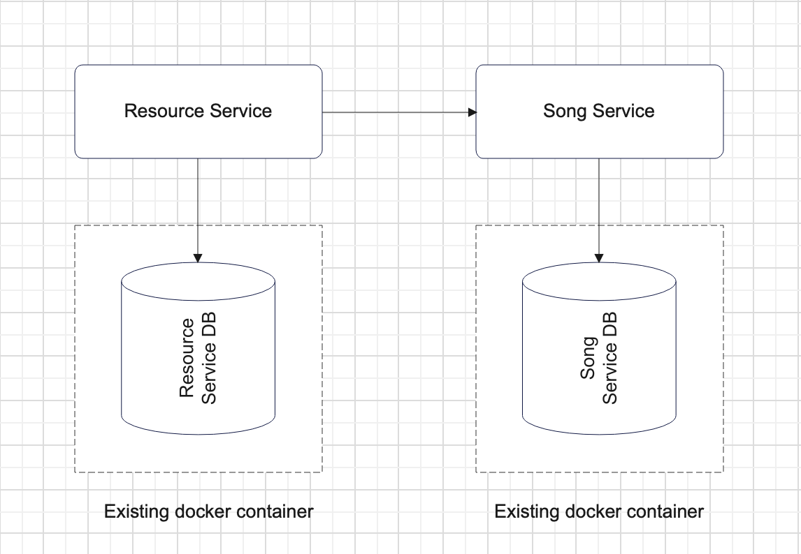

# Kubernetes for Java Engineers

## Base information

Project was taken from Introduction to microservices course
https://github.com/BladeSv/introduction-to-microservices

### Project scheme

# Task 1

### What to do

In this module you will create infrastructure for your k8s cluster and deploy your microservices applications there.

If you have personal licence in Docker Desktop, go to Docker Desktop settings, choose Kubernetes and click checkbox '
Enable Kubernetes'. You will need to wait for the installation and restart docker. In other cases you should go the hard
way:

1. Install docker engine (if not installed) as
   binaries: [https://docs.docker.com/engine/install/binaries/](https://docs.docker.com/engine/install/binaries/). And
   make sure docker is running by running `docker --version`
2. Install minikube: [https://minikube.sigs.k8s.io/docs/start/](https://minikube.sigs.k8s.io/docs/start/). Verify by
   running `minikube start`
3. Install kubectl: [https://kubernetes.io/docs/tasks/tools/](https://kubernetes.io/docs/tasks/tools/) Verify by
   running `kubectl version`

_Note_: When using Windows, running PowerShell as administrator may help. Here's the solution to majority of topics I
faced: [https://stackoverflow.com/questions/57431890/error-response-from-daemon-hcsshimcreatecomputesystem-the-virtual-machine-co](https://stackoverflow.com/questions/57431890/error-response-from-daemon-hcsshimcreatecomputesystem-the-virtual-machine-co)  
After docker will start running Hyper-V containers, make sure to run `minikube docker-env | Invoke-Expression`. This
command will make minikube runn containers on Hyper-V too

## Sub-task 1: Deploy containers in k8s

In this subtask you need to create manifest `.yml` files with configuration for deployment. These files should contain
the next objects:

- Namespace (f.e. k8s-program). All other objects will use this namespace;
- 2 Services (one for each service of your system). Use NodePort service type and configure nodePort field for testing.
- 2 Deployments (one for each service of your system). For apps deployments set `replicas: 2`. You should add
  environment variables for your applications here.

_Note_: don't forget to specify namespace all objects.  
Delete EXPOSE instruction from dockerfiles and upgrade images.  
To deploy, run `kubectl apply ./` in folders where yml files are stored. To view all objects
run `kubectl get all -n=<your_namespace>`.  
Along with services and deployments, this command outputs pods and replica-sets. **Find out why.**

## Sub-task 2: Persistent volumes

In this subtask you will make your app pods use local storage. This will ensure that no data is lost during pod
deploy/redeploy.

1. Add PersistentVolume object with "manual" storage class for the User service (create separate manifest file).
   Configure hostPath field so PersistentVolume create directory on the node.
2. Add PersistenceVolumeClaim objects to your manifest and reference them from User deployment object.
3. Test PersistentVolume: create any file inside the container in the volume directory, scale down deployment or delete
   pod, let replicaset automatically create pod, ensure that file still exists.

## Sub-task 3: Stateful Sets

1. Use StatefulSet object (not Deployment) to create databases.
2. Configure default storage class "hostpath" for volume claim templates, so allowing k8s to provision storage with
   default provisioner (PersistentVolume will be created automatically).
3. Create 2 Services (one for each StatefulSet of your system). Use ClusterIP service type to restrict external access.

_Note_: You can also use `kubectl port-forward pod-name 5433:5432` (local machine port:container port) console command
to temporarily open access to the database pod

# Task 2

### What to do

In this module you will manage secrets and properties for your k8s objects and study deployment strategies.

## Sub-task 1: Secrets and config-maps

1. Add Secrets object to your k8s manifest to store database username and password.
2. Add config maps to store environment variables for application deployments.
3. Add sql scripts to init databases (create tables) to config maps.
4. Change k8s Deployment and StatefulSet objects to load these secrets and config-maps.

## Sub-task 2: Liveness and Readiness probes

1. Add endpoints for health checks at your applications.
2. Add startup, liveness and readiness probes for your Deployment objects at k8s manifest.
3. Add startup, liveness and readiness probes for your StatefulSet objects at k8s manifest.

## Sub-task 3: Deployment strategies

In this module you will add a field to one of your services, and perform Rolling-update deployment.

1. To Song service add a new field `genre (:String)`. Add corresponding logic so this field will represent genre of a
   song. This field also should be returned at the responses for both POST and GET operations.
2. Build a new docker image of application with changes and push it to the Docker Hub (specify another version of
   container).
3. Add Rolling-update deployment strategy to your deployments at manifest files and apply the manifest, so the old
   versions of microservices are deployed and running.
4. Set app version of app containers to the new one and apply manifest one more time. Make sure that new changes are
   deployed.

## Sub-task 4: Deployment history

As you deployed a new version of your application, you can see the history of your deployments. Your task is to roll
back to previous version of your deployment without changing your manifest files. Put in comments the solution of this
task.

# Task 3

### What to do

In this module you will learn how to attach persistent storages to your applications. Also, you will understand how helm
charts work.

## Sub-task 1: Helm chart default variables

1. Install helm [Official download link](https://helm.sh/).
2. Add helm chart to deploy your applications. Make replica-count and namespace a helm values.
3. Add helm values file to store default values for helm variables.
4. Run helm using `helm install` command to deploy applications with default helm variables. Make sure, your
   applications are up and running.
5. Run helm once again, but this time set namespace and replica-count for `helm intall` to non-default values.

## Sub-task 2: Helm chart helpers

1. Create helm `_helpers.tpl` file and define next labels there:

- current date : use helm generator for it's value
- version

2. Make config-map use values as labels from helm `_helpers.tpl` file.